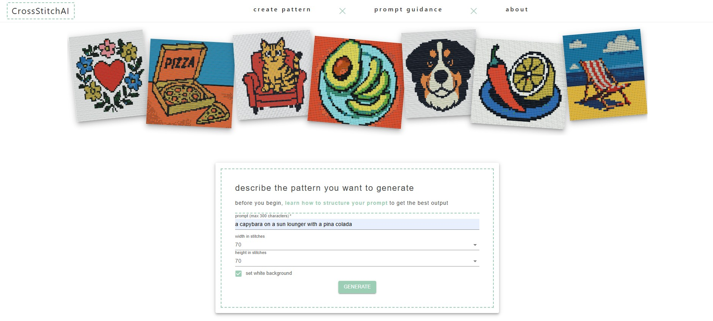
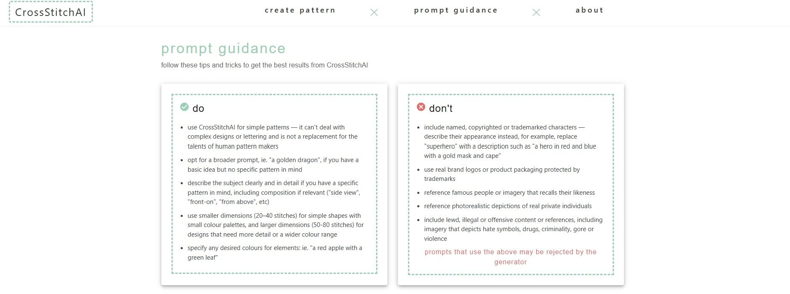
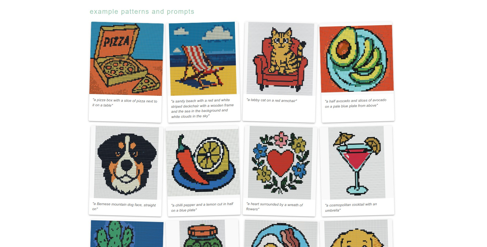
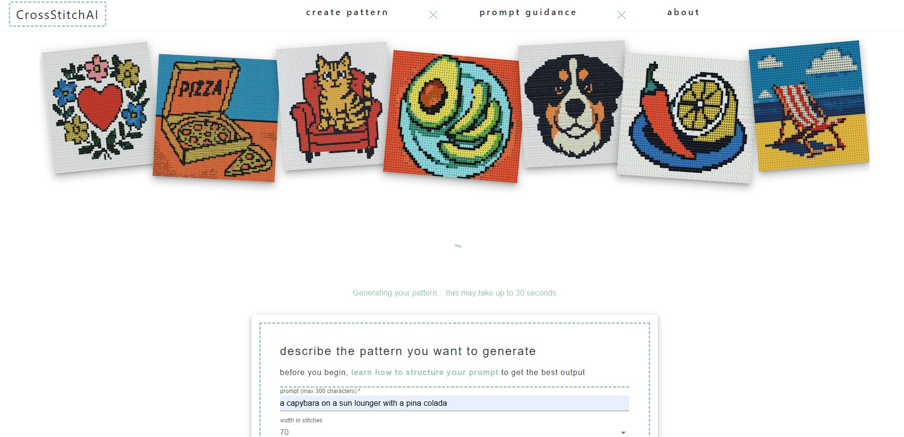
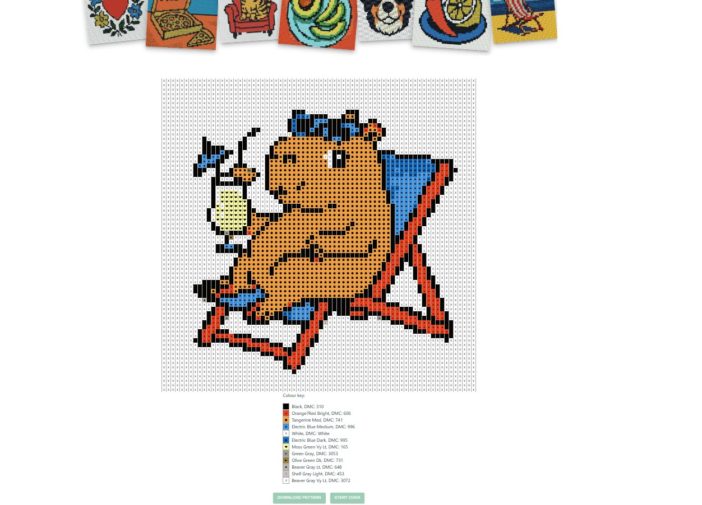
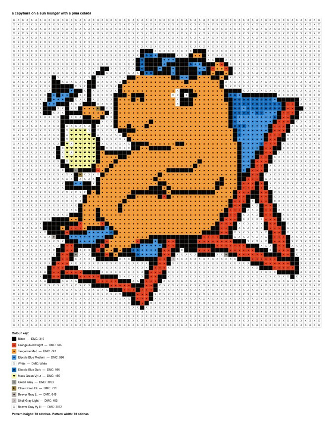

[CrossStitchAI](https://cross-stitch-ai.com/) is a streamlined cross-stitch pattern generator powered by OpenAI's gpt-image-1 model that transforms text prompts into charted patterns with DMC colour keys.

It's best at generating simple, flat patterns — it can't deal with complex designs or lettering and is not a replacement for the talents of human pattern makers.

# How to use CrossStitchAI

## 1. Enter a prompt in the input box and set the pattern size

Before you submit your prompt, check out the [prompt guidance](https://cross-stitch-ai.com/guidance) for tips and tricks to get the best results from CrossStitchAI, plus example prompts and patterns.

Use smaller dimensions (20–40 stitches) for basic shapes with small colour palettes, and larger dimensions (50-80 stitches) for designs that need more detail or a wider colour range.

## 2. Wait for the pattern to generate

Sit back and wait for the chart to appear. This can take up to 30 seconds.

## 3. Review the generated pattern

Each pattern includes a DMC colour key. If the pattern doesn't meet your expectations, review the [prompt guidance](https://cross-stitch-ai.com/guidance) and try again.

Please note, CrossStitchAI is rate limited to 10 pattern generations per hour.

## 4. Download the pattern PDF

The PDF download includes the charted pattern, colour key and dimension details.

